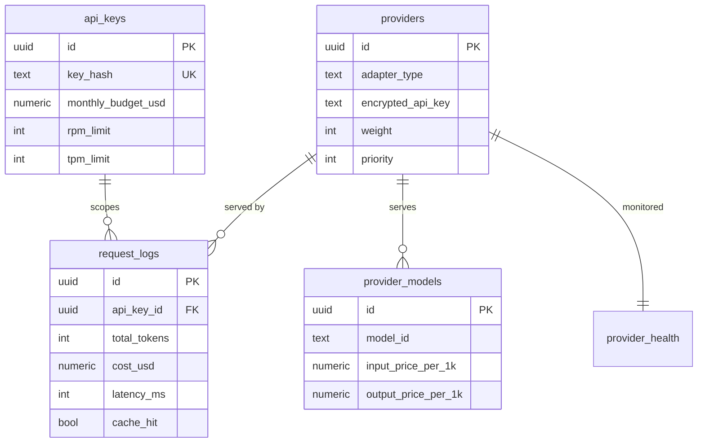

# Architecture

This document complements [GATEWAY.md](../GATEWAY.md) §3–4 with implementation-level detail.

## Layered design

```
src/
  config/        validated env (Zod) — the only gate to process.env
  utils/         logger, crypto, retry, stream(SSE), tokens, errors, constants
  types/         OpenAI wire schemas (Zod) + types
  database/      pg pool + Drizzle, ioredis factory + typed Lua RedisScript, migrations
  providers/     BaseProvider + 5 adapters + registry
  loadbalancer/  facade + 5 strategies (round-robin, weighted, least-conn, latency, random)
  circuit-breaker/  distributed CB (Redis Lua)
  rate-limiter/  sliding window (Redis Lua)
  cache/         semantic cache
  auth/          API-key middleware
  middleware/    request-id, metrics, error-handler
  services/      router (lifecycle), cost-tracker, health-monitor
  routes/        v1 (completions/embeddings/models) + admin/*
  app.ts         Fastify assembly
  index.ts       startup + graceful shutdown
```

**Dependency direction** is strictly downward: routes → services → (providers, resilience
primitives) → (database, utils, config). Shared types live in `types/openai.ts` and the error
taxonomy in `utils/errors.ts` so no layer inverts the graph.

## Why these choices

- **Fastify** — high throughput, schema validation, a clean plugin/encapsulation model used to
  scope auth to `/v1` and admin auth to `/admin`.
- **Drizzle** — type-safe queries with no raw SQL in app code; the hand-written migrations carry
  the DDL Drizzle can't express (partitions, triggers, partial indexes, the materialised view).
- **ioredis without `keyPrefix`** — keyPrefix is not applied to keys passed to `EVAL`/`EVALSHA`
  (our hot paths). Keys are fully-qualified in `utils/constants.ts` so scripts and commands
  agree.
- **Lua via `SCRIPT LOAD` + `EVALSHA`** — the `RedisScript` abstraction loads each script once
  and falls back to `EVAL` on `NOSCRIPT`; every reply is validated by a `parse` function (the
  spec requires validating external inputs, and Redis replies are external).

## Request lifecycle (orchestrated by `services/router.ts`)

1. Request id (UUID v4) → 2. Auth (SHA-256 + Redis cache) → 3. Rate limit (RPM+TPM Lua) →
2. Validate (Zod, 422) → 5. Cache lookup → 6. Resolve model → candidates → 7. Failover loop:
   load-balancer select → circuit-breaker acquire → provider call → record success/failure →
3. Cache store (if eligible) → 9. Record cost + log → 10. Return with gateway headers.

See the sequence diagram in [GATEWAY.md §3](../GATEWAY.md#section-3--architecture-overview).

## Streaming path

The router fetches the **first chunk inside the failover loop** — the last point at which
failover is possible. Once a chunk is emitted, the gateway commits to that provider and pipes
normalised chunks straight to the client (never buffering). TTFB is recorded at the first chunk;
usage/cost are finalised when the stream ends.

## Database schema



`request_logs` is **RANGE-partitioned by `created_at`** (monthly partitions + a DEFAULT safety
partition). `monthly_usage` is a materialised view refreshed hourly. Triggers maintain
`updated_at` and auto-insert a `provider_health` row on provider creation.

## Failure isolation

Every external interaction has a defined degradation: Redis errors degrade the LB to random and
the cache to a miss; DB write failures drop a log line (logged) but never fail the user's
request; provider failures fail over or surface a clean 5xx. The application tier holds no
durable state, so any replica can serve any request.
