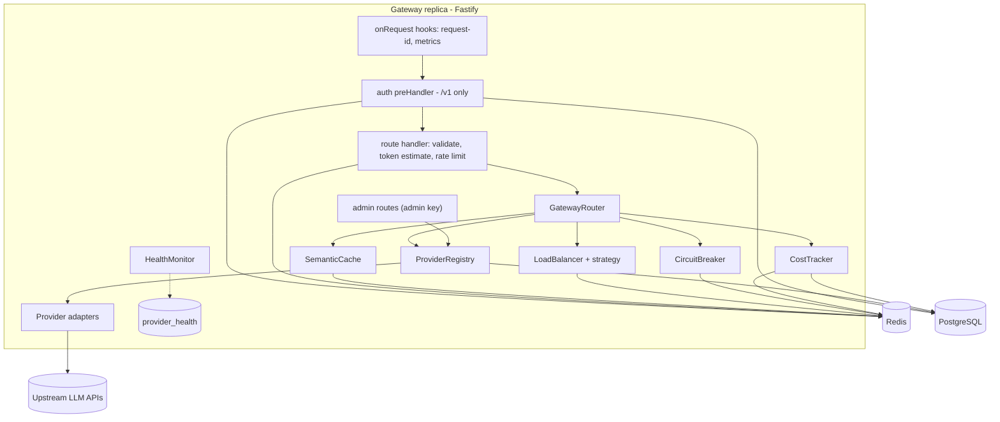
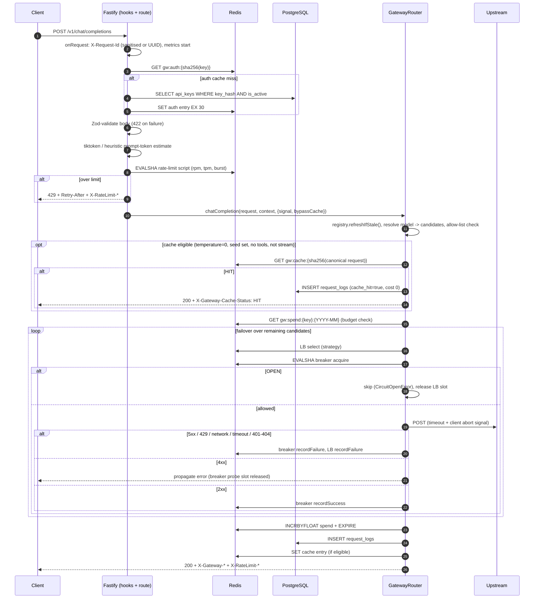
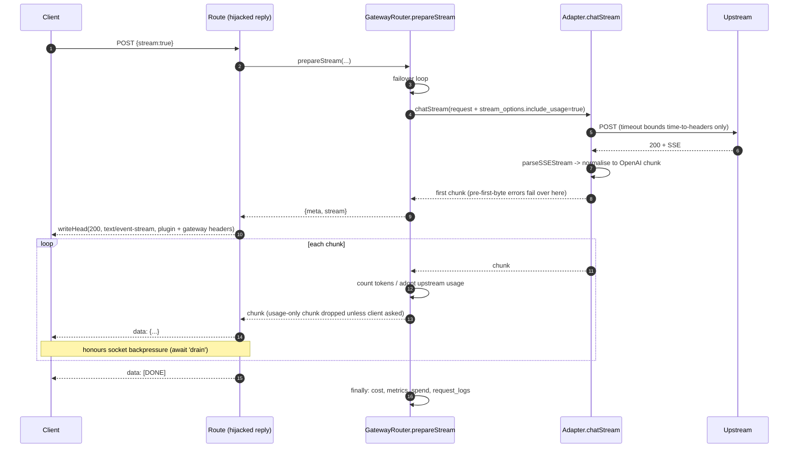
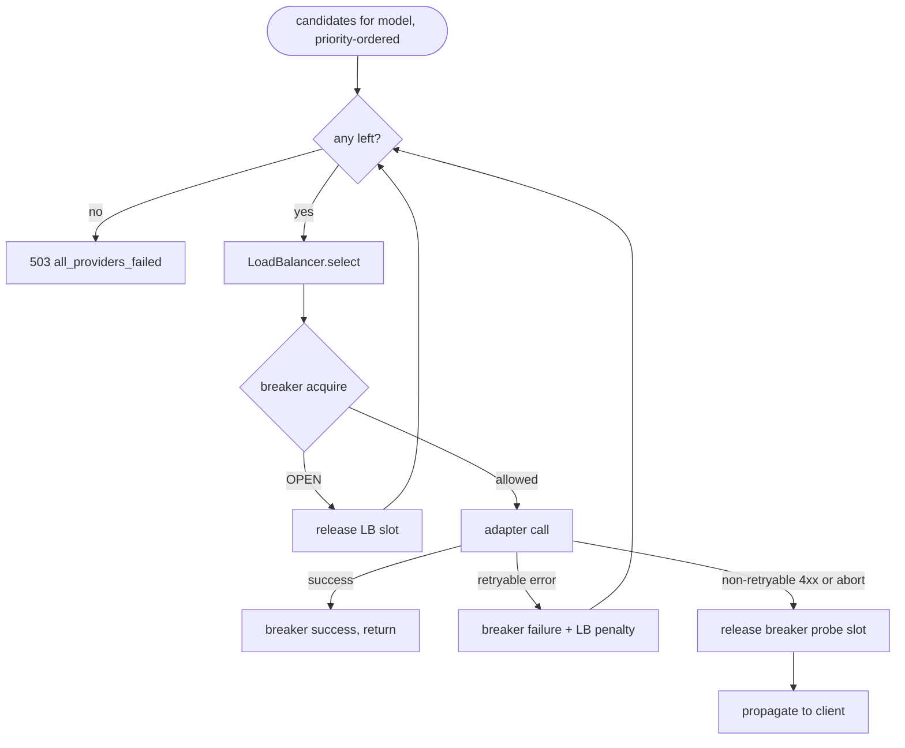
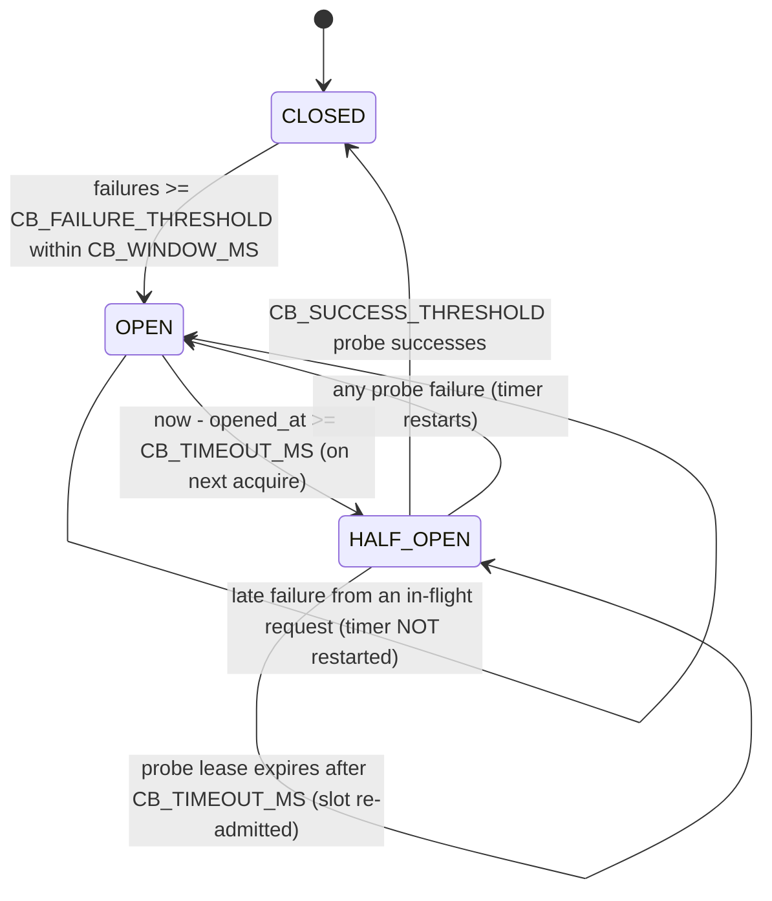

# Architecture

This is the implementation-level architecture. For the problem statement and goals see
[overview.md](./overview.md); for a file-by-file tour see [code-walkthrough.md](./code-walkthrough.md);
the original system document is [GATEWAY.md](../GATEWAY.md).

## 1. Layered design

```
src/
  config/           validated env (Zod) - the only gate to process.env
  utils/            logger, crypto, retry, stream (SSE), tokens, errors, constants
  types/            OpenAI wire schemas (Zod) + types
  database/         pg pool + Drizzle, ioredis factory + typed Lua RedisScript, SQL migrations
  providers/        BaseProvider + 5 adapters + registry (model -> candidates)
  loadbalancer/     facade + 5 strategies
  circuit-breaker/  distributed breaker (Redis Lua)
  rate-limiter/     sliding window (Redis Lua)
  cache/            exact-match response cache
  auth/             API-key authentication
  middleware/       request-id, metrics, error-handler
  services/         router (request lifecycle), cost-tracker, health-monitor
  routes/           /v1 (completions, embeddings, models) + /admin/*
  app.ts            Fastify assembly
  index.ts          startup + graceful shutdown
```

Dependency direction is downward: `routes -> services -> (providers, resilience primitives) ->
(database, utils, config)`. `GatewayRouter` receives its collaborators through a `RouterDeps`
object (`src/services/router.ts`), which is what makes it unit-testable with fakes
(`tests/unit/services/router.test.ts`).

## 2. Component diagram


```mermaid
flowchart TB
    subgraph Replica[Gateway replica - Fastify]
        direction TB
        HOOKS[onRequest hooks: request-id, metrics] --> AUTH[auth preHandler - /v1 only]
        AUTH --> ROUTE[route handler: validate, token estimate, rate limit]
        ROUTE --> ROUTER[GatewayRouter]
        ROUTER --> CACHE[SemanticCache]
        ROUTER --> REG[ProviderRegistry]
        ROUTER --> LB[LoadBalancer + strategy]
        ROUTER --> CB[CircuitBreaker]
        ROUTER --> COST[CostTracker]
        REG --> AD[Provider adapters]
        ADMIN["admin routes (admin key)"] --> REG
        HM[HealthMonitor] -.-> PGH[(provider_health)]
    end
    AUTH --> REDIS[(Redis)]
    ROUTE --> REDIS
    CACHE --> REDIS
    LB --> REDIS
    CB --> REDIS
    COST --> REDIS
    AUTH --> PG[(PostgreSQL)]
    REG --> PG
    COST --> PG
    AD --> UP[(Upstream LLM APIs)]
```

## 3. Request lifecycle - non-streaming

Source of truth: `src/routes/completions.ts` and `GatewayRouter.chatCompletion`
(`src/services/router.ts`).


```mermaid
sequenceDiagram
    autonumber
    participant C as Client
    participant G as Fastify (hooks + route)
    participant R as Redis
    participant D as PostgreSQL
    participant RT as GatewayRouter
    participant U as Upstream

    C->>G: POST /v1/chat/completions
    G->>G: onRequest: X-Request-Id (sanitised or UUID), metrics start
    G->>R: GET gw:auth:{sha256(key)}
    alt auth cache miss
        G->>D: SELECT api_keys WHERE key_hash AND is_active
        G->>R: SET auth entry EX 30
    end
    G->>G: Zod-validate body (422 on failure)
    G->>G: tiktoken / heuristic prompt-token estimate
    G->>R: EVALSHA rate-limit script (rpm, tpm, burst)
    alt over limit
        G-->>C: 429 + Retry-After + X-RateLimit-*
    end
    G->>RT: chatCompletion(request, context, {signal, bypassCache})
    RT->>RT: registry.refreshIfStale(), resolve model -> candidates, allow-list check
    opt cache eligible (temperature=0, seed set, no tools, not stream)
        RT->>R: GET gw:cache:{sha256(canonical request)}
        alt HIT
            RT->>D: INSERT request_logs (cache_hit=true, cost 0)
            RT-->>C: 200 + X-Gateway-Cache-Status: HIT
        end
    end
    RT->>R: GET gw:spend:{key}:{YYYY-MM}  (budget check)
    loop failover over remaining candidates
        RT->>R: LB select (strategy)
        RT->>R: EVALSHA breaker acquire
        alt OPEN
            RT->>RT: skip (CircuitOpenError), release LB slot
        else allowed
            RT->>U: POST (timeout + client abort signal)
            alt 5xx / 429 / network / timeout / 401-404
                RT->>R: breaker recordFailure, LB recordFailure
            else 4xx
                RT-->>C: propagate error (breaker probe slot released)
            else 2xx
                RT->>R: breaker recordSuccess
            end
        end
    end
    RT->>R: INCRBYFLOAT spend + EXPIRE
    RT->>D: INSERT request_logs
    RT->>R: SET cache entry (if eligible)
    RT-->>C: 200 + X-Gateway-* + X-RateLimit-*
```

Notes that matter when reasoning about latency:

- The request-log insert (`CostTracker.recordRequest`) is **awaited inside the request path**
  unless noted otherwise in [benchmarks.md](./benchmarks.md); a slow or unreachable PostgreSQL
  therefore delays responses.
- Auth, rate limiting, breaker, spend and cache each add one Redis round trip; ioredis
  auto-pipelining (`enableAutoPipelining` in `src/database/redis.ts`) coalesces concurrent commands.

## 4. Request lifecycle - streaming


```mermaid
sequenceDiagram
    autonumber
    participant C as Client
    participant G as Route (hijacked reply)
    participant RT as GatewayRouter.prepareStream
    participant A as Adapter.chatStream
    participant U as Upstream

    C->>G: POST {stream:true}
    G->>RT: prepareStream(...)
    RT->>RT: failover loop
    RT->>A: chatStream(request + stream_options.include_usage=true)
    A->>U: POST (timeout bounds time-to-headers only)
    U-->>A: 200 + SSE
    A->>A: parseSSEStream -> normalise to OpenAI chunk
    A-->>RT: first chunk (pre-first-byte errors fail over here)
    RT-->>G: {meta, stream}
    G-->>C: writeHead(200, text/event-stream, plugin + gateway headers)
    loop each chunk
        A-->>RT: chunk
        RT->>RT: count tokens / adopt upstream usage
        RT-->>G: chunk (usage-only chunk dropped unless client asked)
        G-->>C: data: {...}
        Note over G,C: honours socket backpressure (await 'drain')
    end
    G-->>C: data: [DONE]
    RT->>RT: finally: cost, metrics, spend, request_logs
```

Properties (all verified in code):

- **Failover only before the first byte.** `runFailover` calls `iterator.next()` inside the loop
  (`prepareStream`); after that, a mid-stream error just ends the response (the route logs and
  closes the socket; no JSON error body is possible once headers are sent).
- **Headers are written after the first upstream chunk**, so for streams "TTFB" at the client
  includes the upstream's time to first frame plus gateway overhead.
- **Client disconnect** aborts the upstream request: `clientAbortSignal` (`src/routes/http.ts`) is
  an `AbortController` fired on the raw socket `close` event when the response has not finished;
  adapters compose it with their timeout via `AbortSignal.any` (`BaseProvider.upstreamFetch`).
- **Accounting** (`finally` block of the generator) runs on success, error and client abort. Prompt
  tokens are estimated up-front; completion tokens are estimated at ~chars/4 per delta until an
  authoritative usage chunk arrives, which then wins.
- The provider timeout (`timeoutMs`) applies to _time to response headers_ for streams, and to the
  whole exchange for non-streaming calls.

## 5. Failover flow


```mermaid
flowchart TD
    S([candidates for model, priority-ordered]) --> L{any left?}
    L -- no --> F[503 all_providers_failed]
    L -- yes --> P[LoadBalancer.select]
    P --> A{breaker acquire}
    A -- OPEN --> RL[release LB slot] --> L
    A -- allowed --> CALL[adapter call]
    CALL -- success --> OK[breaker success, return]
    CALL -- retryable error --> FAIL[breaker failure + LB penalty] --> L
    CALL -- non-retryable 4xx or abort --> REL[release breaker probe slot] --> ERR[propagate to client]
```

A candidate is only ever tried once per request (`remaining` shrinks), so a request touches at
most N providers for N candidates. Retryable = HTTP 429, 5xx, timeout, network fault, and (since
`BaseProvider.mapHttpError` was fixed) upstream 401/402/403/404, which indicate a gateway-side
credential/billing/model-mapping fault.

## 6. Circuit breaker state machine


```mermaid
stateDiagram-v2
    [*] --> CLOSED
    CLOSED --> OPEN: failures >= CB_FAILURE_THRESHOLD within CB_WINDOW_MS
    OPEN --> HALF_OPEN: now - opened_at >= CB_TIMEOUT_MS (on next acquire)
    HALF_OPEN --> CLOSED: CB_SUCCESS_THRESHOLD probe successes
    HALF_OPEN --> OPEN: any probe failure (timer restarts)
    HALF_OPEN --> HALF_OPEN: probe lease expires after CB_TIMEOUT_MS (slot re-admitted)
    OPEN --> OPEN: late failure from an in-flight request (timer NOT restarted)
```

Transitions are single Lua scripts (`ACQUIRE_LUA`, `SUCCESS_LUA`, `FAILURE_LUA`, `RELEASE_LUA` in
`src/circuit-breaker/index.ts`). OPEN -> HALF_OPEN is evaluated lazily in `acquire`: there is no
timer, the breaker moves only when a request asks. Details in [reliability.md](./reliability.md).

## 7. State placement

| State                       | Store          | Key / table                                | Lifetime                          |
| --------------------------- | -------------- | ------------------------------------------ | --------------------------------- |
| API keys, providers, models | PostgreSQL     | `api_keys`, `providers`, `provider_models` | durable                           |
| Request audit log           | PostgreSQL     | `request_logs` (monthly range partitions)  | pruned by cron (6 months)         |
| Provider health probes      | PostgreSQL     | `provider_health`                          | overwritten each probe            |
| Provider registry snapshot  | process memory | `ProviderRegistry`                         | `REGISTRY_CACHE_TTL_SECONDS`      |
| Auth lookup cache           | Redis          | `gw:auth:{sha256}`                         | `AUTH_CACHE_TTL_SECONDS`, sliding |
| Rate-limit windows          | Redis ZSETs    | `gw:rl:{rpm,tpm,burst}:{keyId}`            | window + 1 s                      |
| Circuit-breaker state       | Redis          | `gw:cb:{providerId}:*`                     | explicit (no TTL on state)        |
| Response cache              | Redis          | `gw:cache:{sha256}`                        | `CACHE_DEFAULT_TTL_SECONDS`       |
| Cache hit/miss counters     | Redis          | `gw:cstats:{hits,misses}`                  | none                              |
| Monthly spend               | Redis          | `gw:spend:{keyId}:{YYYY-MM}`               | 40 days                           |
| LB statistics               | Redis          | `gw:lb:{lat,conn,wrr}:*`                   | 5-10 min TTLs                     |
| Round-robin counters        | process memory | `RoundRobinStrategy.counters`              | process                           |

Because spend counters and breaker state have no durable copy, Redis eviction must not remove
them: use `volatile-lru` (see [deployment.md](./deployment.md)). A Redis flush resets budgets.

## 8. Technology choices

- **Fastify 4** - low overhead, encapsulated plugins: `authPreHandler` is scoped to the `/v1` plugin
  and `adminAuthPreHandler` to `/admin` (`src/app.ts`).
- **Drizzle ORM + hand-written SQL migrations** - Drizzle for typed queries; the migrations carry the
  DDL it cannot express (partitioned table, triggers, partial indexes, materialised view).
- **ioredis without `keyPrefix`** - `keyPrefix` is not applied to `EVAL` key arguments, so keys are
  fully qualified in `redisKeys` (`src/utils/constants.ts`).
- **Lua over MULTI/pipeline** - the rate limiter, breaker and several balancers need read-decide-write
  atomicity. The `RedisScript` helper (`src/database/redis.ts`) does `SCRIPT LOAD` + `EVALSHA` and
  falls back to `EVAL` on `NOSCRIPT`.
- **Redis Cluster caveat** - the multi-key scripts use keys that do not share a hash tag
  (e.g. `gw:rl:rpm:{id}` / `gw:rl:tpm:{id}` / `gw:rl:burst:{id}`), so they would fail with
  `CROSSSLOT` on a clustered Redis. The documentation elsewhere that suggests "Redis (cluster)" for
  scale-out is therefore not drop-in for the current key scheme. (Not tested here: no cluster was run.)

## 9. Failure isolation matrix (verified)

The verified behaviours are summarised here; the experiments are in [benchmarks.md](./benchmarks.md#dependency-outages).

| Dependency down | Behaviour                                                                                                                                                     |
| --------------- | ------------------------------------------------------------------------------------------------------------------------------------------------------------- |
| Upstream 5xx    | Fail over to next candidate; breaker opens after `CB_FAILURE_THRESHOLD` failures.                                                                             |
| Redis           | See [benchmarks.md](./benchmarks.md#dependency-outages) for measured client-visible behaviour. The breaker fails open; the rate limiter does not (it throws). |
| PostgreSQL      | See the same section: auth falls back to Redis cache, but the request-log write is on the request path.                                                       |
