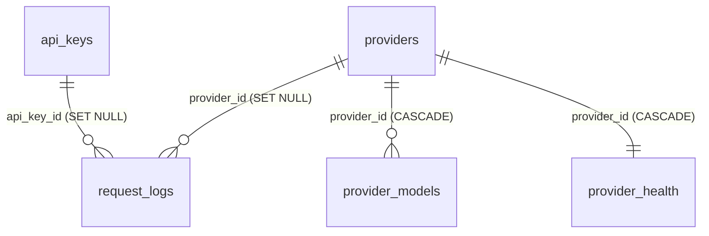

# Data model

PostgreSQL 16 is the system of record. Schema definition: `src/database/schema.ts` (Drizzle, used for typed queries) and
`src/database/migrations/*.sql` (hand-written DDL, the actual source of the schema). Migrations are applied by
`scripts/migrate.ts` (`npm run db:migrate`), which records each file in `_migrations(name pk, applied_at)` and runs files in lexical order, each in a
transaction unless it contains the literal text `-- migrate:no-transaction` (matched anywhere in the file - do not mention it in a comment of an ordinary
migration). `gen_random_uuid()` is core PostgreSQL (>= 13); no extensions are required.

## Enum `adapter_type`

`openai | anthropic | gemini | mistral` (0001) `| cohere` (0002, added with `ALTER TYPE ... ADD VALUE IF NOT EXISTS`,
hence `-- migrate:no-transaction`). Adding an adapter = a new additive migration of the same shape.

## `api_keys`

| Column                     | Type               | Notes                                                                   |
| -------------------------- | ------------------ | ----------------------------------------------------------------------- |
| `id`                       | uuid PK            | `gen_random_uuid()`. Used as the Redis scope for rate limits and spend. |
| `key_hash`                 | text unique        | hex SHA-256 of the raw key. Never reversible.                           |
| `name`                     | text null          | free text label (<= 256 chars via API).                                 |
| `owner_id`                 | uuid null          | opaque tenant id; no FK, informational.                                 |
| `is_active`                | boolean            | default true; DELETE in the admin API sets false (soft delete).         |
| `expires_at`               | timestamptz null   | checked at auth (DB path and cached path).                              |
| `monthly_budget_usd`       | numeric(10,4) null | null = unlimited. Compared with the Redis spend counter.                |
| `allowed_models`           | text[] null        | null/empty = all models.                                                |
| `rpm_limit`                | integer            | default 60.                                                             |
| `tpm_limit`                | integer            | default 100 000 (compared with _estimated prompt tokens_ only).         |
| `created_at`, `updated_at` | timestamptz        | `updated_at` maintained by trigger `api_keys_set_updated_at`.           |

Indexes: `api_keys_active_key_hash_idx (key_hash) WHERE is_active`, `api_keys_owner_idx (owner_id)`.
`rpm_limit`/`tpm_limit` are only constrained to >= 1 by the admin API; the Redis rate-limit sorted sets grow with the
number of requests in the window, so a huge RPM limit means huge sorted sets (see
[rate-limiting-and-quotas.md](./rate-limiting-and-quotas.md)).

## `providers`

| Column                     | Type         | Notes                                                                      |
| -------------------------- | ------------ | -------------------------------------------------------------------------- |
| `id`                       | uuid PK      | Also the circuit-breaker / load-balancer identity in Redis.                |
| `name`                     | text unique  | Display name; also the Prometheus `provider` label.                        |
| `base_url`                 | text         | Joined with the adapter's path (`/chat/completions`, `/v1/messages`, ...). |
| `adapter_type`             | adapter_type | Selects the adapter class.                                                 |
| `encrypted_api_key`        | text         | `v1.<iv>.<tag>.<ct>` AES-256-GCM envelope.                                 |
| `weight`                   | integer      | default 1; used by WRR and LATENCY_BASED.                                  |
| `priority`                 | integer      | default 1; orders candidates (1 = first).                                  |
| `is_active`                | boolean      | false removes the provider on the next registry load.                      |
| `health_check_url`         | text null    | Probed by the health monitor with no credentials.                          |
| `timeout_ms`               | integer      | default 60 000; per-provider upstream timeout.                             |
| `created_at`, `updated_at` | timestamptz  | `updated_at` by trigger.                                                   |

Triggers: `providers_set_updated_at`; `providers_create_health` inserts a `provider_health` row (`unknown`) after every insert.
Indexes: `providers_active_idx` (partial), `providers_priority_idx`.

## `provider_models`

`id` uuid PK; `provider_id` FK -> providers (CASCADE); `model_id` text (the OpenAI-facing id clients use); `display_name`,
`context_window`, `max_output_tokens` (used as Anthropic/Gemini default `max_tokens`), `input_price_per_1k` / `output_price_per_1k`
`numeric(10,6)` (USD per 1000 tokens; null = free in cost math), `supports_streaming/tools/vision` (informational - the router does
**not** filter candidates by capability), `is_active`, `created_at`. Unique `(provider_id, model_id)`. Indexes on `provider_id` and a partial
index on `model_id WHERE is_active`.

## `provider_health`

One row per provider (`provider_id` PK/FK CASCADE): `status` (`unknown|healthy|degraded|unhealthy`), `latency_ms`, `error_message`,
`checked_at`. Upserted by the health monitor; read only by `GET /admin/providers/:id/health`.

## `request_logs` (RANGE-partitioned by `created_at`)

| Column                                               | Type          | Notes                                                                 |
| ---------------------------------------------------- | ------------- | --------------------------------------------------------------------- |
| `id`                                                 | uuid          | part of the PK `(id, created_at)` (partition key must be in the PK).  |
| `api_key_id`, `provider_id`                          | uuid null     | FKs with `ON DELETE SET NULL`. `provider_id` is null on cache hits.   |
| `model_id`                                           | text          | canonical model id.                                                   |
| `prompt_tokens`, `completion_tokens`, `total_tokens` | integer       | see [cost-tracking.md](./cost-tracking.md) for the sources.           |
| `cost_usd`                                           | numeric(10,6) | rounded to 6 decimals.                                                |
| `latency_ms`                                         | integer       | upstream latency (0 for hits); for streams, full stream duration.     |
| `status_code`                                        | integer       | 200, or 502 for an interrupted stream. Other failures are not logged. |
| `cache_hit`, `failover_count`, `error_message`       |               |                                                                       |
| `created_at`                                         | timestamptz   | partition key.                                                        |

Indexes (created on the parent, propagate to partitions): `(api_key_id, created_at)`, `(provider_id, created_at)`.

### Partitions

- `request_logs_default` - the DEFAULT partition: any row whose month has no partition lands here.
- Monthly partitions `request_logs_YYYY_MM` created by SQL function `create_request_logs_partition(year, month)`
  (idempotent `CREATE TABLE IF NOT EXISTS ... PARTITION OF ... FOR VALUES FROM (first day) TO (first day of next month)`).
  0001 pre-creates the current and next month.
- Helm CronJobs (`helm/ai-gateway/templates/cronjob.yaml`): `create-partition` on the 25th at 03:00 runs `npm run partition:create`
  (creates **next** month); `prune-logs` on the 1st at 04:00 drops the partition from **six months ago**
  (`DROP TABLE IF EXISTS request_logs_<YYYY_MM of now()-6 months>`); `refresh-usage` hourly refreshes `monthly_usage`.
- Failure mode: if next month's partition was not created in time, rows go to `request_logs_default`. Creating that month's partition
  afterwards then **fails** in PostgreSQL ("updated partition constraint for default partition would be violated by some row") until the
  offending rows are moved out of the default partition. Run the CronJob well before month end and alert if it fails. The prune job
  never touches the default partition or months it skipped.

## Materialised view `monthly_usage`

`(api_key_id, year_month 'YYYY-MM', total_requests, total_tokens, total_cost_usd)`, unique index `monthly_usage_pk`
(required for `REFRESH MATERIALIZED VIEW CONCURRENTLY`). Created `WITH NO DATA` then refreshed once in the migration; refreshed hourly by
cron. Nothing in the application reads it.

## Redis keyspace (all prefixed by `REDIS_KEY_PREFIX`, default `gw:`)

| Key                                                      | Type                           | Written by             | TTL                                   |
| -------------------------------------------------------- | ------------------------------ | ---------------------- | ------------------------------------- |
| `auth:{sha256}`                                          | string (JSON `GatewayContext`) | `authenticateKey`      | `AUTH_CACHE_TTL_SECONDS` sliding      |
| `rl:rpm:{keyId}` / `rl:tpm:{keyId}` / `rl:burst:{keyId}` | ZSET                           | rate limiter Lua       | window + 1 s                          |
| `cb:{providerId}:state` / `opened_at`                    | string                         | breaker Lua            | none                                  |
| `cb:{providerId}:failures`                               | string                         | breaker Lua            | `CB_WINDOW_MS` (refreshed on failure) |
| `cb:{providerId}:half_probes`                            | string                         | breaker Lua            | `CB_TIMEOUT_MS` lease                 |
| `cb:{providerId}:half_successes`                         | string                         | breaker Lua            | none (deleted on close/open)          |
| `cache:{sha256}`                                         | string (JSON response)         | `SemanticCache.set`    | `CACHE_DEFAULT_TTL_SECONDS`           |
| `cstats:hits` / `cstats:misses`                          | string counter                 | `SemanticCache`        | none                                  |
| `spend:{keyId}:{YYYY-MM}`                                | string float                   | `CostTracker.addSpend` | 40 days                               |
| `lb:lat:{providerId}`                                    | string (EMA ms)                | latency strategy       | 10 min                                |
| `lb:conn:{providerId}`                                   | string counter                 | least-connections      | 10 min                                |
| `lb:wrr:{setKey}`                                        | hash                           | smooth WRR             | 5 min                                 |
