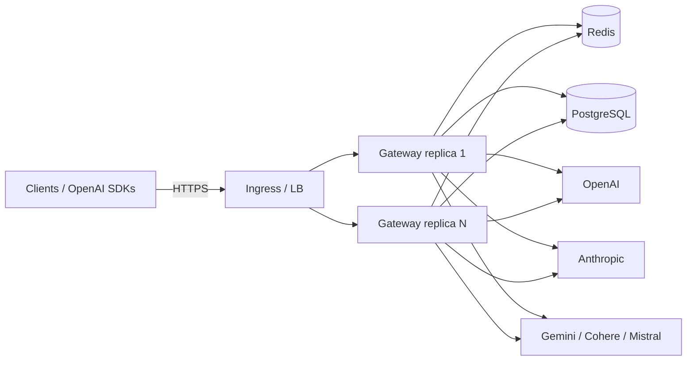

# Overview

## The problem

Applications that call LLMs directly accumulate the same set of cross-cutting concerns in every
service: one SDK per provider, hand-rolled retry and fallback, per-team spend tracking, rate
limiting against provider quotas, and credential sprawl (a provider key in every deployment).
When a provider has an incident, each of those copies fails in its own way.

This project centralises those concerns in one network hop. Clients speak the **OpenAI wire
protocol** to the gateway; the gateway authenticates the caller, applies limits, picks an
upstream, calls it with the right dialect, and returns an OpenAI-shaped response. Upstream
credentials live only in the gateway's database (AES-256-GCM encrypted).

## Goals

| Goal                         | How it is met                                                                                                     | Where                                                                    |
| ---------------------------- | ----------------------------------------------------------------------------------------------------------------- | ------------------------------------------------------------------------ |
| Drop-in OpenAI compatibility | `/v1/chat/completions`, `/v1/embeddings`, `/v1/models`, OpenAI error envelope, SSE streaming ending in `[DONE]`   | `src/routes/*`, `src/types/openai.ts`, `src/middleware/error-handler.ts` |
| Multi-provider routing       | Provider adapters for OpenAI, Anthropic, Gemini, Cohere, Mistral behind one `BaseProvider` interface              | `src/providers/*`                                                        |
| Survive provider failures    | Pre-first-byte failover across candidates, per-provider circuit breaker shared through Redis                      | `src/services/router.ts`, `src/circuit-breaker/index.ts`                 |
| Protect upstream quotas      | Per-key sliding-window RPM/TPM limiter implemented as one Lua script                                              | `src/rate-limiter/index.ts`                                              |
| Control spend                | Per-model price table, per-request cost estimate, monthly per-key budget enforced before each call                | `src/services/cost-tracker.ts`                                           |
| Keep secrets safe            | SHA-256 API-key hashes, AES-256-GCM provider credentials, constant-time admin-key compare, log redaction          | `src/utils/crypto.ts`, `src/auth/middleware.ts`, `src/utils/logger.ts`   |
| Be operable                  | Prometheus metrics, structured logs, readiness/liveness split, graceful shutdown, Helm chart, partition cron jobs | `src/middleware/metrics.ts`, `src/index.ts`, `helm/`, `k8s/`             |

## Non-goals

These are deliberate omissions, not gaps to be closed silently:

- **No semantic (embedding-similarity) cache.** The "semantic cache" is an exact-match cache over a
  canonicalised request (see [caching.md](./caching.md)). The name is historical.
- **No prompt/response content filtering or PII scrubbing.** The gateway is a transparent proxy.
- **No per-request retry against the same provider.** Failover to a different candidate is the
  only retry mechanism (`src/utils/retry.ts` exists and is unit-tested but nothing in `src/` calls
  it; the `RETRY_*` settings are therefore currently inert - see [reliability.md](./reliability.md)).
- **No billing system.** Cost figures are estimates from a price table you maintain, stored in
  Redis counters and `request_logs`; they are not reconciled against provider invoices.
- **No multi-tenant admin RBAC.** There is exactly one admin credential.
- **No mid-stream failover.** Once the first byte is sent to the client the gateway is committed
  to that provider (a stream cannot be un-sent).

## Shape of the system

Gateway replicas are stateless. Everything that must be shared between replicas (circuit-breaker
state, rate-limit windows, cache entries, spend counters, load-balancer statistics, auth cache)
lives in Redis; durable data (keys, providers, models, request logs) lives in PostgreSQL.

## What "production-grade" means here, honestly

The code base ships with unit, integration, e2e and security suites, a Helm chart, CI, and load
tests. The [audit notes in design-decisions.md](./design-decisions.md#known-limitations-and-open-issues)
list what is still open. The measured behaviour - including where the previous documentation's
performance claims did not hold - is in [benchmarks.md](./benchmarks.md).
